# 한옥 창호 생성기 사용 설명서

설치부터 웹 화면으로 창을 설계해 CNC 패키지를 받기까지를 화면 그림과 함께 안내합니다. 그림은 배포 0.4.1(생성 엔진 0.2.0)에서 찍었습니다.
명령과 입력 형식의 전체 목록은 [생성기 README](../../README.md)에, 저장소 구성은 [저장소 안내](../../../README.md)에 있습니다.

> 검사 PASS는 명목 CAD 기하의 합격입니다. 목재·공구·경첩으로 시험편을 가공해 확인하기 전에는 기계로 보내지 마십시오([범위와 한계](../../README.md#범위와-한계)).

## 목차

- [준비물](#준비물)
- [설치](#설치)
- [켜고 끄기](#켜고-끄기)
- [설계하기](#설계하기)
- [기록과 패키지 화면](#기록과-패키지-화면)
- [패키지에 들어 있는 것](#패키지에-들어-있는-것)
- [명령줄로 쓰기](#명령줄로-쓰기)
- [LLM과 함께 쓰기](#llm과-함께-쓰기)
- [문제 해결](#문제-해결)
- [그림 다시 만들기](#그림-다시-만들기)

## 준비물

| 항목 | 내용 |
|---|---|
| 컴퓨터 | macOS. Linux에서도 같은 명령으로 쓰며, Finder용 더블클릭 파일만 쓸 수 없습니다. Windows 설치와 실행은 [생성기 README의 Windows 절](../../README.md#windows)에 있습니다 |
| Python | 3.11 이상. 터미널에서 `python3.11 --version`으로 확인합니다. 없으면 [python.org](https://www.python.org/downloads/)의 설치 파일이나 Homebrew(`brew install python@3.11`)로 설치합니다 |
| 브라우저 | 최신 브라우저. 그림은 Chrome으로 찍었습니다 |
| 인터넷 | 설치할 때 의존 패키지를 받는 데만 씁니다. 쓰는 동안에는 이 컴퓨터 안(127.0.0.1)에서만 통신합니다 |

## 설치

처음 한 번만 합니다. 터미널(응용 프로그램 › 유틸리티 › 터미널)을 열고 차례로 입력합니다.

1. 생성기 폴더로 옮겨 갑니다. `/경로/`는 저장소를 둔 곳으로 바꿉니다.

   ```bash
   cd /경로/hanok_window/generator
   ```

2. 이 폴더 전용 파이썬 환경(`.venv`)을 만듭니다. 컴퓨터의 다른 파이썬 프로그램에는 영향이 없습니다.

   ```bash
   python3.11 -m venv .venv
   ```

3. 검증한 버전의 의존 패키지와 생성기를 설치합니다.

   ```bash
   .venv/bin/python -m pip install -r requirements.lock
   .venv/bin/python -m pip install -e .
   ```

4. 설치를 확인합니다. 도움말이 나오면 끝입니다.

   ```bash
   .venv/bin/hanok-window --help
   ```

`requirements.lock`은 CPython 3.11로 Windows 11(AMD64)과 GitHub Actions의 ubuntu 24.04·macOS 26(arm64)에서 검증한 버전 목록입니다. 저장소를 새 버전으로 받은 뒤에는 3번의 두 번째 줄(`pip install -e .`)을 다시 실행해야 화면에 새 버전이 표시됩니다.

## 켜고 끄기

**Finder에서:** generator 폴더의 `web-start.command`를 두 번 누릅니다. 터미널 창이 열려 서버를 켜고, 기본 브라우저가 http://127.0.0.1:8765 를 엽니다. 터미널 창은 닫아도 됩니다. 다 쓰면 `web-stop.command`를 두 번 눌러 끕니다.

**터미널에서:** generator 폴더에서 `web.sh`를 씁니다.

```bash
./web.sh start      # 켜고 브라우저로 엽니다
./web.sh status     # 켜져 있는지 봅니다
./web.sh stop       # 끕니다. 진행 중인 생성은 끝까지 기다립니다
./web.sh restart    # 껐다가 다시 켭니다
./web.sh log        # 서버 기록의 마지막 40줄
```

켜지면 이렇게 알려 줍니다.

```text
켜졌습니다: http://127.0.0.1:8765
끄려면 ./web.sh stop (Finder에서는 web-stop.command)
```

- 서버는 이 컴퓨터에서만 열립니다. 같은 네트워크의 다른 컴퓨터나 휴대폰으로는 접속할 수 없습니다.
- 브라우저나 터미널 창을 닫아도 서버는 계속 켜져 있습니다. 다 쓰면 끄세요.
- 다른 포트로 켜려면 `./web.sh start --port 8800`, 브라우저를 열지 않으려면 `--no-open`을 붙입니다.

## 설계하기

### 화면 구성

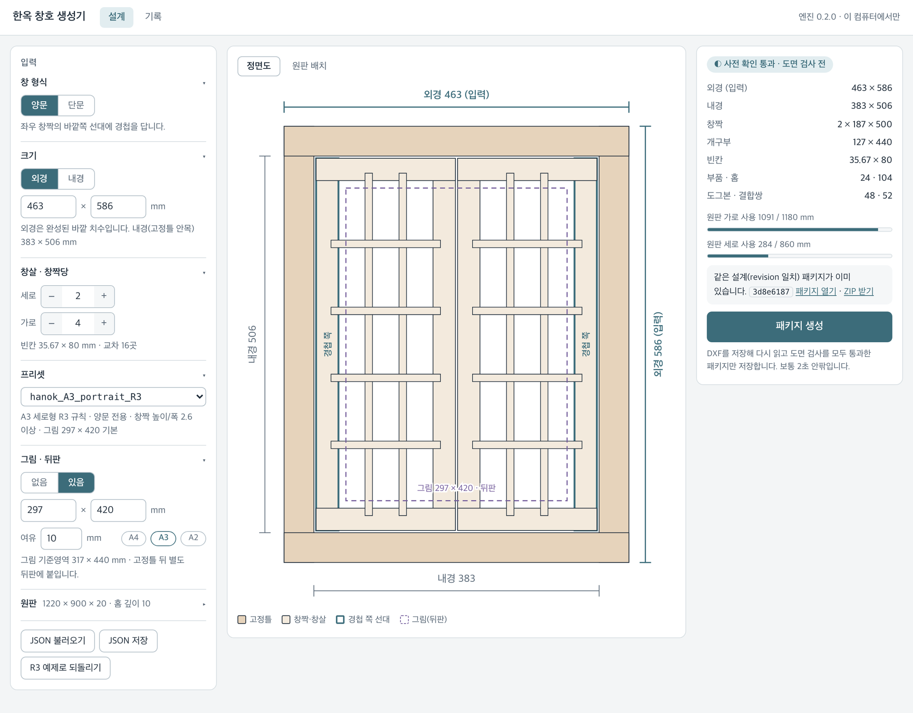

처음 열면 R3 예제(양문, 외경 463 × 586 mm, 창살 2+4, A3 그림)가 들어 있습니다. 왼쪽 **입력**을 바꾸고 0.15초가 지나면 서버가 설계를 해석해 가운데 **미리보기**와 오른쪽 **요약**을 새로 그립니다. 위쪽의 **설계**와 **기록**으로 화면을 바꿉니다.

### 입력

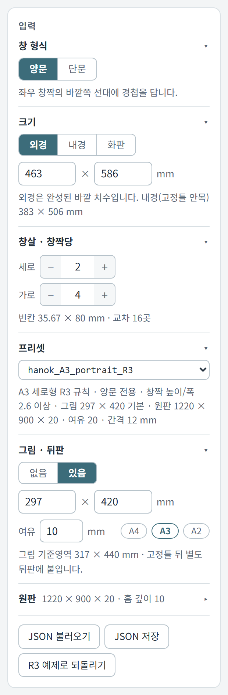

| 묶음 | 하는 일 |
|---|---|
| 창 형식 | **양문**(좌우 두 짝, 두 짝 모두 바깥쪽 선대에 경첩) 또는 **단문**(한 짝) |
| 크기 | **외경** 또는 **내경** 기준의 가로 × 세로(mm) |
| 창살 · 창짝당 | 한 짝에 들어가는 세로·가로 창살 수. −/+ 단추나 직접 입력으로 바꾸고, 0개도 됩니다. 아래에 빈칸 크기와 교차 수가 나옵니다 |
| 프리셋 | `standard_v1`(기본) 또는 `hanok_A3_portrait_R3`(R3 규칙: 양문 전용, 창짝 높이/폭 2.6 이상, A3 그림 기본) |
| 그림 · 뒤판 | 고정틀 뒤 별도 뒤판에 붙이는 그림. 없음/있음, 크기, 여유, A4·A3·A2 단추 |
| 원판 | 목재 원판 크기(기본 1220 × 900 × 20 mm)와 홈 깊이. 눌러서 펼칩니다 |
| 아래 단추 | 입력을 JSON 파일로 **불러오기**·**저장**, **R3 예제로 되돌리기** |

### 단문과 경첩 방향

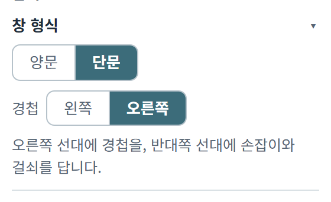

단문을 고르면 경첩 방향(왼쪽·오른쪽)을 고르는 칸이 나타납니다. 오른쪽을 고르면 오른쪽 선대에 경첩을, 반대쪽 선대에 손잡이와 걸쇠를 답니다. R3 프리셋은 양문 전용이므로 단문은 `standard_v1`으로 설계합니다.

### 외경과 내경

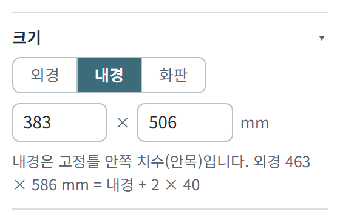

**외경**은 완성된 바깥 치수, **내경**은 창짝이 들어가는 고정틀 안쪽 치수(안목)입니다. 외경 = 내경 + 2 × 40 mm(고정틀 폭)이므로 R3의 외경 463 × 586은 내경 383 × 506과 같은 창입니다. 기준을 바꾸면 같은 창이 되도록 숫자를 바꿔 넣습니다.

### 미리보기

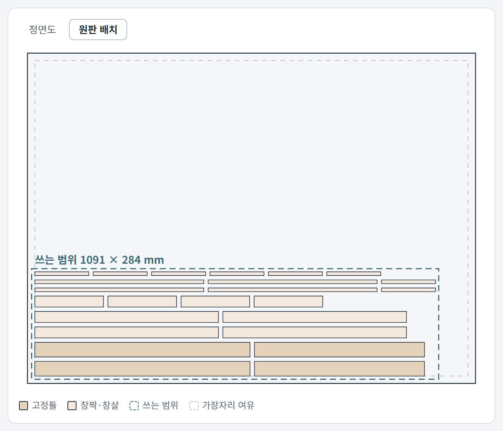

**정면도** 탭은 창을 앞에서 본 모양과 외경·내경 치수를, **원판 배치** 탭은 모든 부품을 원판 한 장에 놓은 모습을 보여 줍니다. 진한 점선은 실제로 쓰는 범위(이 예에서 1091 × 284 mm), 옅은 점선은 원판 가장자리 여유입니다.

### 규칙을 어겼을 때

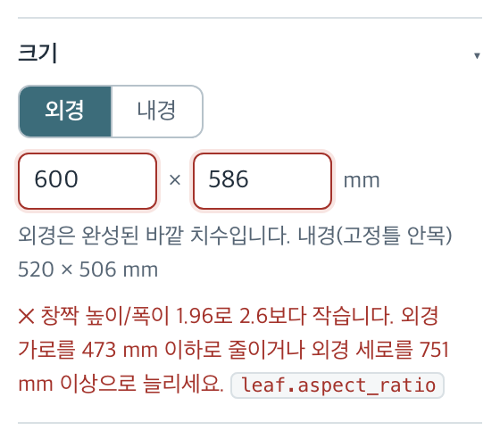

규칙을 어기면 해당 칸이 빨갛게 바뀌고 아래에 원인과 고치는 값이 나옵니다. 위 그림은 R3 프리셋에서 외경 가로를 600으로 넣은 경우입니다. 창짝이 너무 넓어 높이/폭이 1.96이 되었으니, 가로를 473 mm 이하로 줄이거나 세로를 751 mm 이상으로 늘리라고 알려 줍니다. 끝의 회색 글자(`leaf.aspect_ratio`)는 규칙 이름입니다.

고치는 값은 입력 하나만 바꿔 엔진에 다시 물어 찾은 값이며, 다음 규칙에서 나옵니다.

| 규칙 | 알려 주는 값 |
|---|---|
| 창살이 너무 많음 | 들어가는 최대 창살 수, 그 창살이 들어가는 최소 크기 |
| 개구부가 남지 않음 | 개구부가 생기는 최소 크기 |
| 창짝 높이/폭(R3) | 통과하는 최대 가로와 최소 세로 |
| 참고 경첩 간격 | 경첩 두 개가 들어가는 최소 세로 |
| 그림이 들어가지 않음 | 들어가는 그림 크기·여유, 그림이 들어가는 최소 크기 |
| 부품이 원판보다 큼, 원판 폭 부족 | 필요한 원판 크기와 창 크기 |

값 하나는 그 규칙만 풀므로 고친 뒤 다른 규칙이 나올 수 있습니다. 예를 들어 R3 프리셋은 외경 세로 586 mm에서 가로 463~473 mm만 A3 그림과 창짝 높이/폭을 함께 통과합니다.

### 패키지 생성

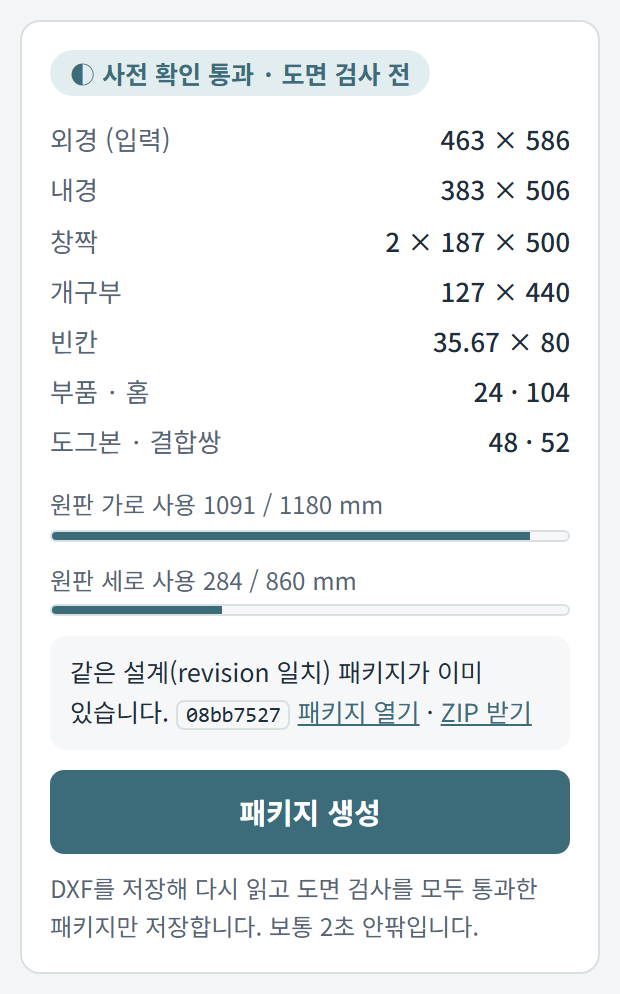

오른쪽 요약에는 해석한 치수(외경·내경·창짝·개구부·빈칸), 부품·홈·도그본·결합쌍 수, 원판 사용량이 나옵니다. **사전 확인 통과 · 도면 검사 전**은 규칙과 원판 배치를 통과했다는 뜻이고, 홈끼리 붙는지 같은 판정은 아직 하지 않은 상태입니다.

**패키지 생성**을 누르면 DXF를 저장해 다시 읽고, 검사 68개를 모두 통과한 경우에만 패키지를 저장합니다. 보통 2초 안팎이 걸리고, 끝나면 그 패키지 화면으로 넘어갑니다. 같은 설계의 패키지가 이미 있으면 그림처럼 알려 주고 **패키지 열기**와 **ZIP 받기**를 바로 보여 줍니다. 같은 실행 환경(OS, 글꼴, Python과 라이브러리 버전)에서는 같은 입력이 언제나 같은 패키지 ID가 되며, 이미 있는 패키지를 덮어쓰지 않습니다. 다른 컴퓨터에서 만든 패키지와 같은 설계인지는 revision으로 봅니다.

### 생성 단계에서 실패하면

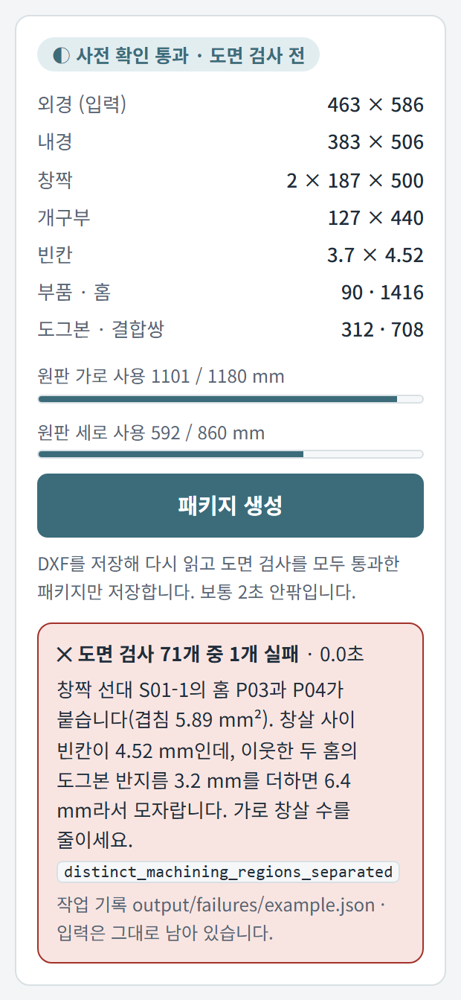

사전 확인을 통과해도 저장한 DXF를 검사하는 단계에서 떨어질 수 있습니다. 그림은 창살을 세로 9 · 가로 30으로 늘린 경우입니다. 빈칸이 4.52 mm인데 이웃한 두 홈의 도그본 반지름을 더하면 6.4 mm가 필요해서 홈끼리 붙는다고 알려 줍니다. 실패하면 패키지를 저장하지 않고 실패한 검사와 이유, 작업 기록 파일(`output/failures/…`)을 보여 줍니다. 입력은 그대로 남아 있으니 창살 수를 줄여 다시 생성합니다.

## 기록과 패키지 화면

### 기록

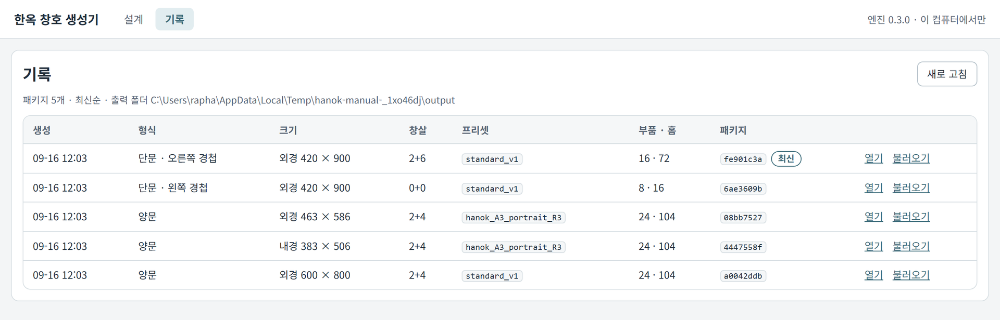

위쪽 **기록**을 누르면 `output/`에 만든 패키지가 최신순으로 나옵니다. **열기**는 패키지 화면을, **불러오기**는 그 패키지의 입력을 설계 화면에 채웁니다. 마지막으로 만든 패키지에는 **최신**이 붙습니다.

### 패키지 화면

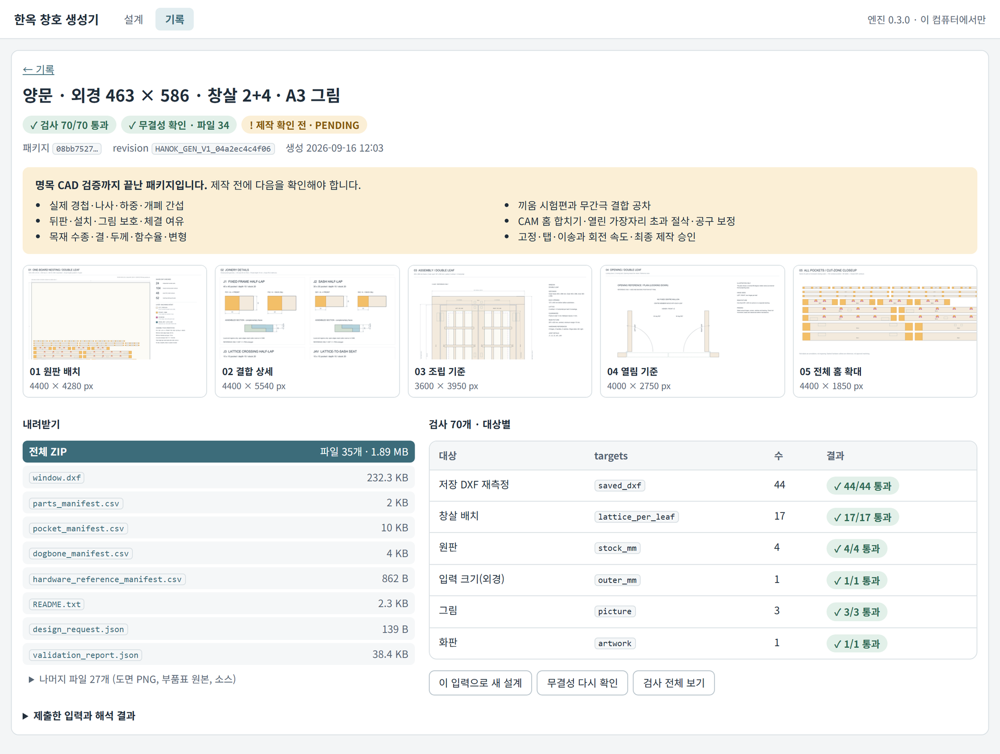

- **제목과 배지:** 형식·크기·창살·그림, 검사 통과 수(68/68), 파일 무결성(파일 34개), 제작 확인 전(PENDING).
- **제작 전에 확인할 것:** 명목 CAD 검증까지 끝났다는 표시와 실제 제작 전에 확인할 여섯 가지(경첩·나사·하중, 뒤판과 그림 고정, 목재, 끼움 공차, CAM 설정, 고정과 가공 조건).
- **도면 다섯 장:** 누르면 뷰어로 크게 봅니다.

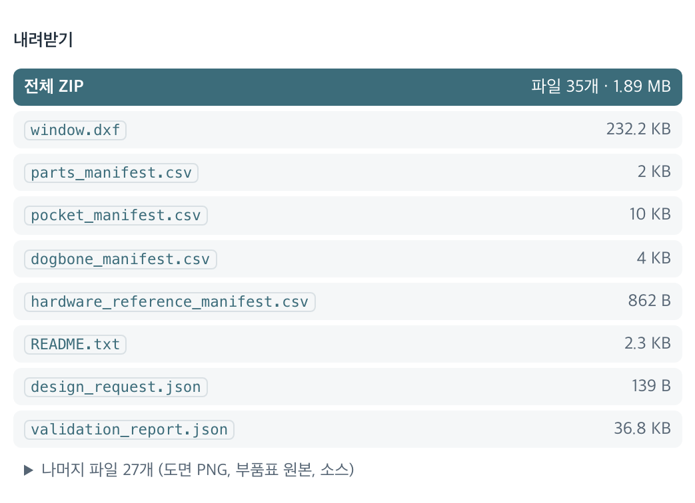

**내려받기**에서는 전체 ZIP(패키지 파일 34개와 매니페스트, 모두 35개)을 받거나 파일을 하나씩 받습니다. 보내기 전에 매니페스트의 해시와 대조하므로, 패키지가 만들어진 뒤 바뀐 파일은 내려받을 수 없습니다.

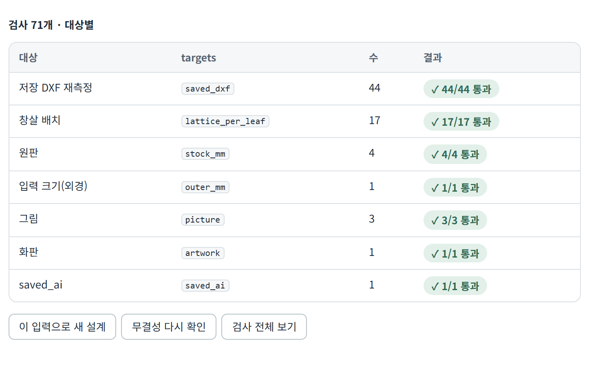

**검사**는 대상별로 묶여 있고 **검사 전체 보기**로 68개를 하나씩 봅니다. **이 입력으로 새 설계**는 이 패키지의 입력을 설계 화면에 채우고, **무결성 다시 확인**은 파일 해시를 다시 대조합니다.

### 도면 뷰어

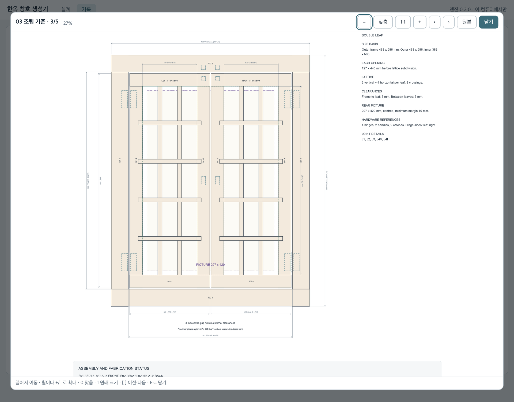

도면을 누르면 화면 가득 크게 봅니다. 끌어서 옮기고 휠이나 +/−로 확대합니다. 단축키는 `0` 맞춤, `1` 원래 크기, `[`·`]` 이전·다음, `Esc` 닫기입니다. **원본**은 전체 해상도 PNG를 엽니다.

## 패키지에 들어 있는 것

패키지는 `output/packages/<패키지 ID>/` 폴더 하나이며, ZIP으로 받아도 같은 파일이 들어 있습니다.

| 파일 | 쓰임 |
|---|---|
| `window.dxf` | CNC 가공용 DXF. 모든 부품을 원판 한 장에 배치했습니다 |
| `01_*.png` ~ `05_*.png` | 도면 다섯 장 (아래 그림) |
| `parts_manifest.csv` | 부품표 |
| `pocket_manifest.csv` | 홈 목록과 좌표 |
| `dogbone_manifest.csv` | 도그본(안쪽 모서리의 공구 여유) 목록 |
| `hardware_reference_manifest.csv` | 경첩·손잡이·캐치의 참고 위치 |
| `README.txt` | 가공 메모 |
| `validation_report.json` | 검사 68개의 결과 |
| `design_request.json` | 제출한 입력. 이 파일로 같은 패키지를 다시 만들 수 있습니다 |
| `source/` | 이 패키지를 만든 소스와 의존 버전 |

아래는 R3 예제 패키지의 도면입니다. 원본은 가로 3600~4400 px이며, 여기에는 가로 1200 px로 줄여 실었습니다.

### 01 원판 배치

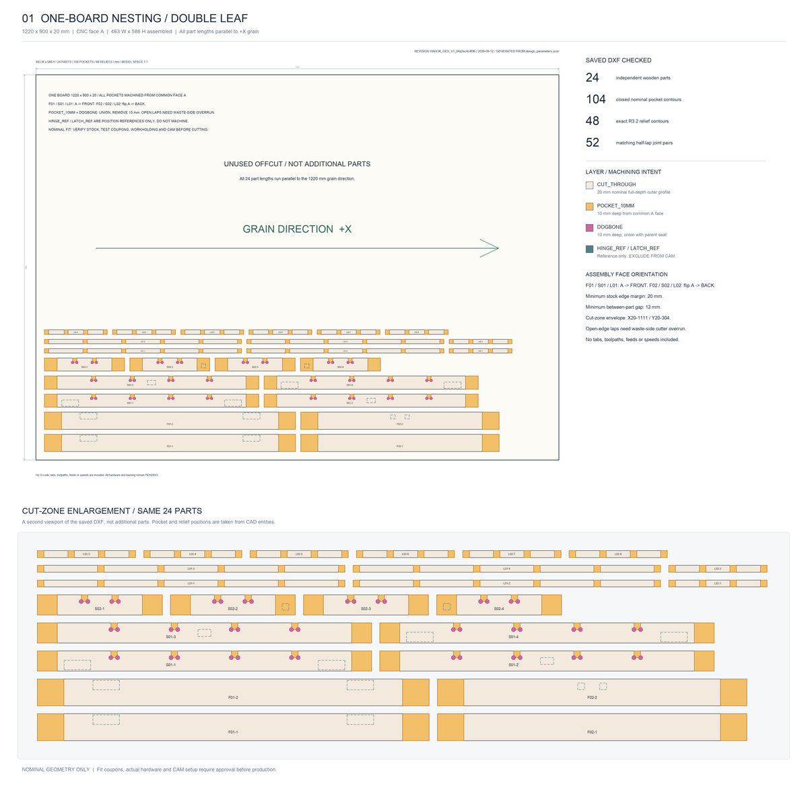

모든 부품을 원판(1220 × 900 × 20 mm) 한 장에 놓은 배치와 나뭇결 방향입니다.

### 02 결합 상세

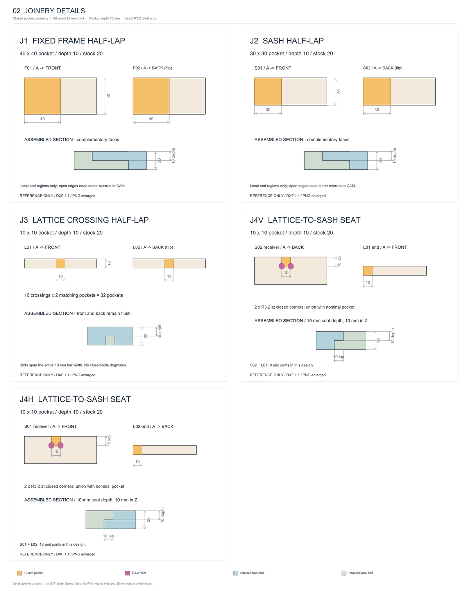

고정틀 모서리(J1)와 창짝 모서리(J2)의 반턱, 창살 교차(J3), 창살이 테두리에 앉는 자리(J4V·J4H)입니다. 해당 결합이 없는 설계에서는 그 상세를 그리지 않습니다.

### 03 조립 기준

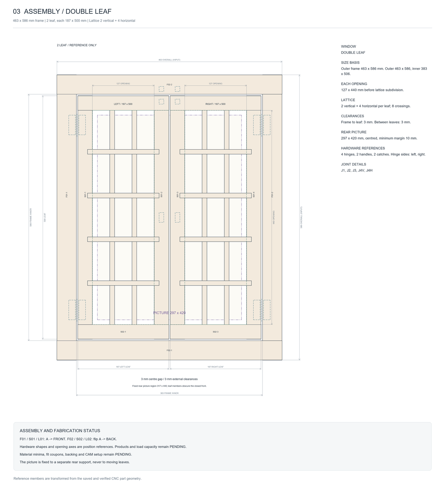

정면에서 본 조립도입니다. 외경·내경, 창짝, 개구부, 그림 위치와 참고 경첩·손잡이·캐치 자리를 적었습니다.

### 04 열림 기준

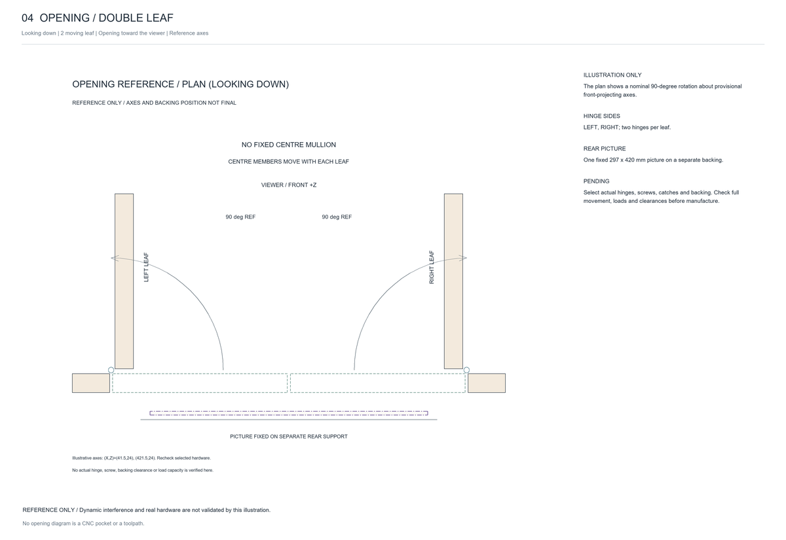

위에서 내려다본 평면으로 창짝이 열리는 방향을 보여 줍니다.

### 05 전체 홈 확대

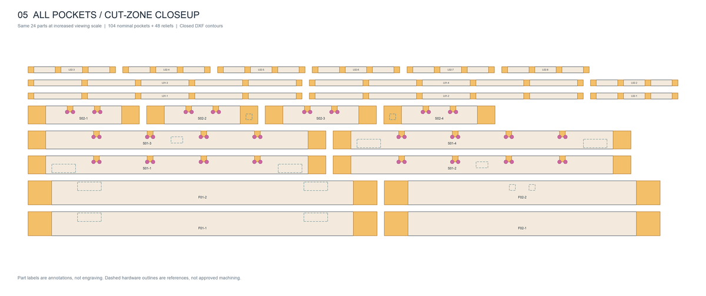

모든 홈을 크게 모아 보여 줍니다.

## 명령줄로 쓰기

웹 화면 없이 터미널에서도 같은 패키지를 만듭니다.

```bash
.venv/bin/hanok-window build --input examples/double_r3.json --output output      # 예제 입력으로 만들기
.venv/bin/hanok-window build --type double --size 600x800 --lattice 2x4 --output output
.venv/bin/hanok-window resolve --type single --hinge-side right --size 420x900 --lattice 2x6   # 사전 확인만
.venv/bin/hanok-window verify output/packages/<패키지 ID>                               # 파일 해시 대조
```

`--input`으로 준 JSON은 웹 화면에서 저장한 JSON과 같은 형식이라, 같은 입력이면 웹과 패키지 ID가 같습니다. `--size 463x586`처럼 옵션으로 준 크기는 실수(463.0)로 기록되어 revision은 같아도 패키지 ID가 다릅니다. 모든 옵션은 [생성기 README의 명령줄](../../README.md#명령줄)에 있습니다.

## LLM과 함께 쓰기

Claude, GPT, Gemini, 로컬 모델 같은 LLM이 도구 호출로 이 생성기를 쓸 수 있습니다. MCP를 지원하는 클라이언트에는 `mcp.sh`의 절대 경로를 등록합니다.

```bash
claude mcp add hanok-window -- /경로/hanok_window/generator/mcp.sh      # Claude Code
```

Claude Desktop, Cursor, Gemini CLI는 설정 파일에 `{"mcpServers": {"hanok-window": {"command": "/경로/hanok_window/generator/mcp.sh"}}}`를 넣습니다. 등록한 뒤 “양문 600 × 800 mm, 창살 2+4로 한옥 창 패키지를 만들고 조립도를 보여 줘”처럼 부탁하면, 모델이 사전 확인 → 생성 → 도면 보기를 차례로 부릅니다. 규칙을 어기면 모델도 화면과 같은 고치는 값을 받습니다. 도구 목록과 함수 호출 API용 정의는 [생성기 README의 LLM 연동](../../README.md#llm-연동)에 있습니다.

## 문제 해결

| 이런 문구나 증상이 보이면 | 이렇게 합니다 |
|---|---|
| `가상환경(.venv)이 없습니다` | generator 폴더에서 [설치](#설치)의 2~4번을 합니다 |
| `127.0.0.1:8765에서 이미 다른 서버가 응답합니다` | 직접 켠 서버라면 그 터미널에서 Ctrl+C로 끄고, 아니면 `./web.sh start --port 8800`처럼 다른 포트로 켭니다 |
| `켜져 있지만 응답하지 않습니다` | `./web.sh log`로 서버 기록의 마지막 줄을 보고 `./web.sh restart`로 다시 켭니다 |
| `브라우저를 열지 못했습니다` | 브라우저 주소 창에 http://127.0.0.1:8765 를 직접 넣습니다 |
| macOS가 `web-start.command`를 열지 않음 | 인터넷에서 받은 ZIP을 풀어 쓰는 경우입니다. 시스템 설정 › 개인정보 보호 및 보안에서 **그래도 열기**를 누르거나 터미널에서 `./web.sh start`를 씁니다 |
| 입력 칸이 빨갛게 바뀜 | 칸 아래 문구의 값으로 고칩니다([규칙을 어겼을 때](#규칙을-어겼을-때)) |
| 생성이 도면 검사에서 실패 | 결과 카드의 이유대로 창살 수나 크기를 바꿉니다. 작업 기록은 `output/failures/`에 남습니다 |
| 화면의 버전 표시가 예전 그대로 | 새 버전을 받은 뒤 `.venv/bin/python -m pip install -e .`를 다시 합니다 |

## 그림 다시 만들기

화면이 바뀌면 이 폴더의 `make_images.py`로 그림을 다시 만듭니다. 예제 5종을 임시 폴더에 만들고 헤드리스 Chrome으로 화면을 찍으므로 `output/`은 건드리지 않습니다. Chrome이 설치되어 있어야 합니다.

```bash
cd generator
.venv/bin/python docs/manual/make_images.py
```

그림은 `images/`에 덮어씁니다. Chrome이 다른 곳에 있으면 `--chrome /경로/chrome`을 붙입니다.
