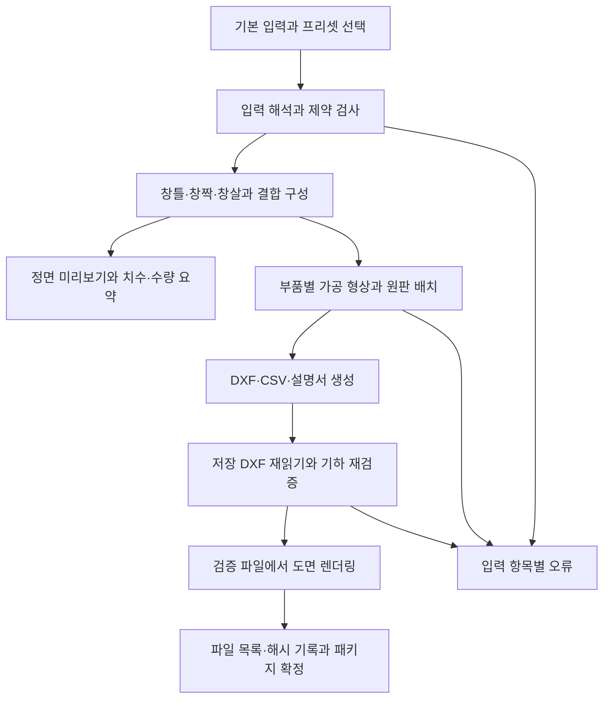

한옥 창호 파라미터 생성 시스템 — 구현 요건 조사

2026-09-12 구현 갱신: 첫 범위 1~4단계를 [generator/README.md](generator/README.md)에 구현했다. 외곽 기준 입력·버전 프리셋, 단문 좌우/양문과 창살 0개, 실제 결합에 따른 상세도, 고정 검사 ID, 작업별 프로세스와 완료 패키지 공개 CLI를 제공한다. 기존 `unified/` R3 28개 파일은 보존했다. 아래 본문은 R2 조사와 R3 검증 보강 당시의 기록이며 범용 생성기의 현재 사용법은 위 README를 기준으로 한다.

구현 상태: 합의한 검증 보강은 PORTRAIT_DL_R3에 적용했다. 진입점은 [unified/00_START_HERE.txt](unified/00_START_HERE.txt), 실제 변경과 검증 결과는 [SPEC_UNIFICATION.md 7절](unified/01_plan/SPEC_UNIFICATION.md:264)에 있다. 이후 교차검증에서 보완한 네 가지(도그본이 외측 변을 뚫는 입력의 파라미터 단계 거부 `lattice.seat_relief_inside_member`, 단문·창살 0개의 지원 범위 거부 `scope.leaf_count`·`scope.lattice_count`, 회귀 시험의 `PYTHONHASHSEED=0` 재실행과 `--record` 기록, 검증 통과 후에만 규격·DXF 교체)는 [7.1절](unified/01_plan/SPEC_UNIFICATION.md:304)에 있다. 따라서 아래 표의 단문·창살 0개 항목은 현재 R3에서 검증 실패가 아니라 입력 단계 거부로 나타난다. 아래 조사 본문과 이전 JSON 기록은 수정 전 R2를 대상으로 한다. 소스 인용은 `research/baselines/PORTRAIT_DL_R2/` 보관본으로 연결했다. 이전 기록에 들어 있는 원본 경로로 시험을 재현할 때도 이 R2 보관본을 사용해야 한다. 단문·프리셋·서비스 구조 등 범용 시스템 요건은 별도 구현 단계로 남는다.

조사일: 2026-09-11. 대상: `unified/02_cnc/`의 PORTRAIT_DL_R2, 자동 검사 59개 버전.

사용자가 공유한 교차 검토를 반영해 경계 조건과 성공 사례를 추가 재현했다. 정정은 이 문서에 통합했으며, 앞선 실행 기록은 [review_correction_probe_results.json](research/review_correction_probe_results.json), 단언 9개 대응표·그림 네 변 실측·삽입 길이 반례·전체 절삭 영역 비교는 [rule_coverage_probe_results.json](research/rule_coverage_probe_results.json)에 보관한다. 소수 입력 200건, 그림·고정틀 비교 결함, 규칙 제거의 대조군과 재현 스크립트는 [decimal_transition_probe_results.json](research/decimal_transition_probe_results.json)에 추가했다. 아래는 R2 조사 당시의 구현 요건이며, 이후 적용한 R3의 범위는 위 구현 상태와 변경 기록에서 구분한다.

구현의 중심은 **기본 입력을 완전한 설계 데이터로 해석하는 규칙 엔진**이다. 사용자는 외곽 가로·세로, 창짝 수, 세로·가로 창살 수만 입력할 수 있지만, 계산에는 부재 폭·두께·간극·결합 방식·공구·원판 정보도 필요하다. 이 나머지 값은 버전이 지정된 프리셋에서 보충하고, 실제 적용한 값을 결과에 함께 저장해야 한다.

이 문서의 기본 범위는 직사각형 창틀, 동일 폭의 1짝 또는 2짝 여닫이, 직교 창살, 현재의 반턱 결합이다. 가로·세로는 **완성 창틀 외곽 치수**, 창살 수는 **창짝당 부재 개수**, 단위는 mm로 해석한다. 아래 데이터 구조와 API는 구현 제안이며 현재 CLI의 입력 규격은 아니다. 계산으로 확인한 명목 형상과 실물 하드웨어·가공 확인의 상태는 구분한다.

현재 코드의 재사용 범위는 다음과 같다. 직접 실행한 변경 시험은 임시 복사본에서 수행했으며 기존 패키지 23개 파일의 해시는 유지됐다. 상세 결과는 [generalization_probe_results.json](research/generalization_probe_results.json)에 기록했다.

| 조사 대상 | 확인 결과 | 일반화에 필요한 작업 |
|---|---|---|
| 부품·홈·도그본 유도 | 부재 교차에서 결합을 만들고 로컬 좌표로 변환하는 엔진이 이미 있음 | 기하 계산을 재사용하고 입력·출력 경로를 함수 인자로 분리 |
| 단문: `leaf.count=1` | 500/377=1.3263이 현재 세장비 하한 2.6에 걸림 | 세장비를 제품 프리셋의 규칙으로 분리 |
| 단문: 세장비 하한만 1.0으로 조정 | 목재 14개·홈 56개·도그본 24개가 유도되지만 `hardware_2hinges_1handles_1catches_reference_only` 실패 | 단문용 경첩·손잡이·캐치 배정과 열림 도면 구현 |
| 외곽만 600×800으로 변경 | 그림 영역이 A3+양쪽 여유와 정확히 같아야 한다는 단언에서 거부 | 창 크기 결정과 후면 그림 배치 분리 |
| 외곽 600×800, 후면 그림 434×634, 여유 10 | 전체 빌드 59개 PASS. 창짝 255.5×714, 빈칸 58.5×122.8 | 기하 엔진은 크기 변경을 이미 처리한다. A3 고정 관계와 문구를 일반화할 것 |
| 세로 창살 0개 또는 가로 창살 0개 | 두 경우 모두 빈칸 균등 검사에서 실패 | 0개를 지원할지 정의하고, 지원 시 없는 부재 계열의 검사·상세도 처리 |
| 세로 12개·가로 4개 | 빈칸 0.538462mm로 전체 빌드 59개 PASS. 도그본을 포함한 인접 안착 홈 절삭 영역이 겹침 | 최소 빈칸·최소 잔존 재료 폭·의도하지 않은 절삭 영역 연결 검사를 우선 추가 |
| 삽입 길이 30 = 창짝 테두리 폭 30 | 파라미터 단언은 허용하지만 도그본 0개 유도. DXF의 도그본 48개 기대 검사에서 실패 | 현재 막힌 안착 홈 모델은 `0 < l < S`로 제한하거나, 전체 폭을 지나는 홈을 별도 결합 유형으로 정의 |
| 원판 길이를 600으로 변경 | 새 선반에 길이 초과 부품을 배치한 뒤 DXF 검사에서 원판 이탈·여유 부족 검출 | `nest()` 새 선반 생성 전에도 X 적재 가능성 검사. 마지막 Y 초과 검사만으로 충분하지 않음 |
| 입력의 동시 처리 | 모듈 전역에 입력·치수·DXF 작업 공간을 보관하고 고정 파일명 사용 | 요청별 설계 객체, 작업 디렉터리, 결과 식별자 도입 |
| 도면·설명 | 양문·A3 문구, 두 방향 열림 그림, 고정 참고도 위치가 남아 있음 | 창짝 수와 도형 외접 범위에 따라 내용·배치 생성 |

관련 구현은 [치수·부품 유도](research/baselines/PORTRAIT_DL_R2/02_cnc/generate_spec.py:116), [하드웨어·열림·검증·출력](research/baselines/PORTRAIT_DL_R2/02_cnc/build_portrait_double_leaf.py:176)에 있다. 단문 시험에서 나무 부품 수량이 만들어졌다는 사실은 단문 패키지의 검증 완료를 뜻하지 않는다.

입력 화면은 아래처럼 기본 항목과 프리셋으로 구성할 수 있다. 숨겨진 기본값도 사용자가 확인할 수 있어야 하며, 입력을 자동으로 고친다면 적용 전에 변경값을 보여줘야 한다.

| 입력 구분 | 항목 | 권장 해석 |
|---|---|---|
| 기본 | 가로, 세로 | 창틀 외곽의 양수 치수. 벽 개구부 치수를 받는 모드는 별도로 정의 |
| 기본 | 단문 / 양문 | `leaf_count=1/2`. 첫 버전은 양문 두 짝의 폭을 동일하게 계산 |
| 기본 | 세로 창살 수, 가로 창살 수 | 창짝당 0 이상의 정수. 칸 수를 입력받는 UI라면 창살 수와 변환 관계를 명시 |
| 조건부 | 단문의 경첩 방향 | 정면 기준 왼쪽 / 오른쪽. 기본값을 선택하더라도 화면에 표시 |
| 프리셋 | 열림 방향·맞댐 방식 | 관람자 쪽/반대쪽, 양문 중앙 간극, 고정 중앙 기둥 유무. 첫 버전은 현재의 중앙 기둥 없는 구조 |
| 프리셋 | 부재 규격 | 창틀 폭, 창짝 테두리 폭, 창살 폭, 재료 두께 |
| 프리셋 | 결합·가공 | 반턱 종류, 삽입 길이, 절삭 깊이, 도그본, 공구 지름, 끼움 공차 |
| 프리셋 | 원판 | 길이·폭·두께·목리·가장자리 여유·부품 간격·사용 가능한 장수 |
| 선택 기능 | 그림 | 없음 / 후면 고정 그림. 그림 크기·배치 여유를 창 외곽과 별도로 처리 |

특히 **프리셋 규칙과 공통 기하 규칙을 나눠야 한다.** 세장비 2.6과 세로 A3는 기존 제품의 조건이다. 이를 모든 크기와 단문에 공통 적용하면 범용 입력을 불필요하게 제한한다. 기존 A3 양문 프리셋에는 채택한 조건을 보존하고, 범용 프리셋에는 지원 치수 범위와 하드웨어 참고 규칙을 따로 정의한다.

경첩은 입력·유도값·요구사항을 구분해야 한다. **현재 코드의 입력은 창짝 끝 여유 60mm**(`hinge_inset_from_leaf_end`)이고, 두 경첩 중심 간격은 `창짝 높이 - 2×끝 여유`다. 현재 높이 500에서는 380, 외곽 600×800으로 확장한 높이 714에서는 594가 된다. 이번 저장 DXF에서도 경첩 중심 Y=103,697, 간격 594를 실측했다. 한편 [계획서의 380을 좁히지 않는다는 문장](research/baselines/PORTRAIT_DL_R2/01_plan/MERGED_PLAN.md:376)은 별도 요구사항이며 코드에 자동 하한 검사는 없다. 범용 모델은 끝 여유와 필요 시 최소 간격을 별도 필드로 표현하고, 380이라는 유도값을 모든 크기의 고정 간격으로 복사하지 않는다. 최소 간격을 채택하면 값의 근거와 적용 프리셋을 함께 기록한다.

후면 그림 기능도 정책이 필요하다. 일반 창 모드에서는 그림이 없어도 계산되어야 한다. 그림을 넣는 모드는 ‘창 크기는 유지하고 그림이 들어가는지 확인’과 ‘그림 크기에서 창 크기를 산정’을 별도로 제공할 수 있다. 기존 A3 전용 모드는 정확한 치수 사슬을 그대로 보존한다. 창 전체를 감싸는 후면 영역과 닫힌 상태에서 실제 보이는 창살 빈칸은 서로 다른 데이터다.

아래는 기본 입력과 프리셋 선택을 표현하는 제안 예시다. 프리셋 이름도 제안이며 아직 구현돼 있지 않다.

```json
{
  "schema_version": 1,
  "design_profile_id": "hanok_rect_half_lap_v1",
  "size": {
    "basis": "frame_outer",
    "width_mm": 600,
    "height_mm": 800
  },
  "opening": {
    "leaf_count": 2,
    "swing": "toward_viewer"
  },
  "lattice": {
    "count_basis": "per_leaf",
    "vertical_bars": 2,
    "horizontal_bars": 4
  },
  "picture": {"mode": "none"},
  "manufacturing_profile_id": "wood20_router6_nominal_v1",
  "stock_profile_id": "board1220x900_v1"
}
```

필수 계산식은 현재 설계에서 일반화할 수 있다. 동일 폭의 창짝, 사방 동일 간극, 동일 부재 폭이라는 위 범위에서 `W,H`는 외곽 치수, `F`는 창틀 부재 폭, `S`는 창짝 테두리 폭, `g`는 창틀-창짝 간극, `c`는 창짝 사이 간극, `n`은 창짝 수, `v,h`는 창짝당 세로·가로 창살 수, `b`는 창살 폭, `l`은 끝 삽입 길이다.

```text
창짝 폭 Lw       = (W - 2F - 2g - (n-1)c) / n
창짝 높이 Lh     = H - 2F - 2g
창짝 내부 폭 Ow  = Lw - 2S
창짝 내부 높이 Oh = Lh - 2S

가로 방향 빈칸 폭 = (Ow - v*b) / (v+1)
세로 방향 빈칸 높이 = (Oh - h*b) / (h+1)
세로 창살 길이   = Oh + 2l
가로 창살 길이   = Ow + 2l

목재 부품 수 = 4 + 4n + n(v+h)
명목 홈 수   = 8 + 8n + 2nvh + 4n(v+h)
도그본 수    = 4n(v+h)
결합쌍 수    = 명목 홈 수 / 2
```

도그본 수식의 명시적 전제는 **`0 < l < S`**, 즉 삽입 길이가 창짝 테두리 폭보다 작아 안착 홈에 막힌 코너 2개가 남는 것이다. 다른 치수와 도그본 반경도 해당 부품에 수용되어야 한다. 초판은 ‘안착 홈당 도그본 2개’라고만 적고 이 경계 조건을 빠뜨렸다. `l=S=30`에서는 홈이 테두리 폭 전체를 지나므로 실제 도그본은 0개다. 현재 `0 < lap <= sm` 단언은 이 경우까지 허용하고, 검증기는 48개를 기대해 거부한다. 구현 단계에서 입력 허용 범위와 결합 유형·수량 기대값을 일치시켜야 한다.

반면 **`삽입 길이 ≤ 개구부 폭·높이`는 현재 직사각형 반턱 구조의 공통 규칙에서 제거하되, 의도하지 않은 절삭 영역 겹침·접촉 검사와 같은 변경으로 적용할 것을 권한다.** 개구부 길이를 `o > 0`이라 하면 창살 전체 길이는 `L=o+2l`이고, 양 끝 반턱 구간은 `[0,l]`, `[l+o,2l+o]`다. 두 구간 사이 거리는 언제나 `o`이므로 `l > o` 자체가 겹침을 만들지 않는다. 삽입 길이는 들어갈 테두리 폭과 실제 잔존 재료에 대해 제한해야 한다.

이를 분리해서 시험하기 위해 개구부 폭 30·삽입 길이 35·세로 창살 1개 조건에서 테두리 폭 40과 50을 각각 사용했다. 임시 복사본에서 해당 단언 한 줄만 제거하고 나머지 단언을 활성화한 일반 실행은 두 경우 모두 59개 PASS다. 저장 DXF의 가로 창살 L02-1 길이는 100, 양 끝 가공 구간은 `[0,35]`, `[65,100]`, 사이 길이는 30mm였다. 전체 부품의 서로 다른 홈 절삭 영역 사이 겹침·접촉도 없었다. 다만 안착 홈과 바깥 긴 변 사이 잔존 폭은 각각 1.8·11.8mm다. 이 차이는 `l ≤ o`로 설명할 수 없으며, 별도의 가장자리 잔존 폭 규칙이 필요하다는 근거다. 이 시험은 기하학적 제한의 필요성을 판별한 것이며 실물 강도나 제작 적합성 검증은 아니다.

규칙을 제거하는 순서에는 조건이 붙는다. 위 테두리 폭 40 조건에서 세로 창살만 1개에서 2개로 바꾸면 빈칸은 10에서 3.333333mm가 된다. 단언 한 줄만 제거한 빌드·재읽기는 이 대조군도 59개 PASS지만, 저장 DXF의 S02-1~4에서 J4 안착 홈 절삭 영역이 각각 한 쌍씩 겹친다. 총 4쌍이며 각 겹침 면적은 약 11.849704mm²다. 기존 상한은 이 작은 개구부를 우연히 차단하고 있었으므로 **상한만 먼저 제거하는 버전은 내보내면 안 된다.** 동일 변경의 완료 조건에 ‘창살 1개인 유효 형상 허용’과 ‘창살 2개인 겹침 형상 거부’를 함께 넣는다. 앞선 제거 권고에는 이 이행 조건이 빠져 있었다.

수량식은 현재의 J1~J4 반턱 구조를 전제로 한다. 다른 결합, 추가 보강재, 고정 중앙 기둥, 유리 고정 부재 등을 도입하면 다시 정의해야 한다. 창살 수가 0인 방향은 빈칸 1개이며, 해당 계열 부품과 결합은 0개가 된다. 창짝 1·2 × 세로 0~5 × 가로 0~6의 84개 조합에서 생성기와 수량식이 일치함을 추가 확인했다. 이 시험은 삽입 길이 10·테두리 폭 30을 유지하고, 단문 기하를 살펴보기 위해 세장비 하한을 1로 설정한 수량 대조이며, 84개 완성 패키지의 가공 검증을 뜻하지 않는다.

| 창짝 수 / 창살 구성 | 목재 | 홈 | 도그본 | 결합쌍 | 근거 |
|---|---:|---:|---:|---:|---|
| 양문 / 2+4 | 24 | 104 | 48 | 52 | 기존 검증 패키지 |
| 양문 / 1+5 | 24 | 92 | 48 | 46 | 앞선 재빌드 검증 및 수량식 |
| 단문 / 2+4 | 14 | 56 | 24 | 28 | 이번 시험의 기하 유도 결과. 하드웨어 검사는 실패 |
| 단문 / 0+0 | 8 | 16 | 0 | 8 | 추가 실행에서 수량 일치 확인. 전체 빌드는 간격·하드웨어 검사에서 실패 |

계산값에는 결과뿐 아니라 어떤 입력과 규칙에서 나왔는지도 기록하는 것이 좋다. 예를 들어 창짝 폭에는 외곽 폭·창틀 폭·간극·창짝 수를, 홈 깊이에는 재료 두께·결합 규칙을 연결한다. 불가능한 입력에서는 ‘생성 실패’ 대신 ‘창살을 배치한 뒤 남는 빈칸이 음수’, ‘부품 길이가 원판 유효 길이를 초과’처럼 바꿔야 할 항목을 반환할 수 있다.

**현재 검증에서 우선 보완할 항목은 최소 잔존 재료 폭이다.** 창살 12+4는 부품 44개·홈 344개·도그본 128개로 59개 검사를 모두 통과하지만, 세로 창살 사이 빈칸과 명목 안착 홈 간격은 7/13 = 0.538462mm다. 검사에는 양수·균등 조건만 있고 제조 프리셋의 최소값이 없다. 더구나 S02-1의 저장 DXF에서 각 안착 홈과 그 도그본을 합친 절삭 영역을 비교하면 인접 영역 간 거리가 0이고 겹침 면적은 약 28.737mm²다. 따라서 0.538mm를 실제로 남는 벽 두께라고 설명하면 부정확하다.


그림은 가공하는 10mm 깊이 층의 평면이다. 반대쪽 미가공 10mm 층은 남으므로 부재 전체가 분리되거나 파손됐다는 뜻은 아니다. 확인된 문제는 의도하지 않은 절삭 영역 연결과 최소 잔존 폭을 현재 검사로 제한하지 않는다는 것이다.

추가 조사에서는 창살 안착 홈에 한정하지 않고, 저장 DXF의 **같은 부재·같은 가공면에서 깊이 구간이 겹치는 모든 홈 쌍**을 비교했다. 각 홈에는 자신의 도그본을 먼저 합쳤다. 기본 2+4는 196쌍에서 겹침 0, 최소 거리 29.266667mm다. 과밀 12+4는 1,516쌍 중 52쌍이 겹치며, 모두 S02 4개에 분포한다.

| 과밀 설계에서 겹치는 절삭 영역 | 쌍 수 | 구현에 주는 의미 |
|---|---:|---|
| J4 안착 홈 ↔ J4 안착 홈 | 44 | 인접 창살 안착 홈 사이의 재료가 가공 깊이 층에서 사라짐 |
| J2 모서리 반턱 ↔ J4 안착 홈 | 8 | 네 S02 부재의 양 끝에서 모서리 결합부와도 연결됨. 창살 홈끼리만 비교하면 누락 |

`min_clear_gap_mm`(보이는 빈칸), `min_machined_web_mm`(실제 홈 사이 잔존 폭), `min_edge_web_mm`(남겨야 할 바깥 가장자리의 잔존 폭), 잔존 두께를 구분해야 한다. 도그본·끼움 공차를 포함한 실제 절삭 형상을 사용하고 면·Z 구간별로 검사한다. 공통 도그본·동일 깊이를 쓰는 현재 배열에서는 명목 간격에서 양쪽 반경을 빼는 식이 빠른 사전 검사에 도움이 되지만, 최종 판정은 실제 형상으로 한다.

최소 잔존 폭의 mm 값을 정하기 전에도 구현할 수 있는 조건이 있다. **분리되어야 하는 서로 다른 가공 영역의 겹침과 접촉은 기하 오류로 거부**한다. 홈과 자신의 도그본처럼 의도적으로 합치는 형상은 먼저 한 가공 영역으로 묶고, 다른 의도적 연결은 결합 모델에 명시한다. 수치 오차 이내의 접촉은 보수적으로 거부하며, 이때 쓰는 기하 허용 오차는 제작용 최소 두께와 별개다. 원호를 다각형으로 바꿔 측정할 때는 양쪽 형상의 근사 오차와 좌표 계산 오차를 합친 판정 범위를 두어, 오차 범위 안의 작은 양수 거리를 확실한 분리로 처리하지 않는다. 연구 기록의 면적·거리 임계값은 해당 겹침 사례를 분류한 값이며 최종 수치 정책을 확정한 것이 아니다. 현재 네스팅 좌표에서는 모든 가공이 A면·깊이 10이지만, 향후 B면이나 다른 깊이를 지원하면 실제 Z 구간을 비교해야 한다.

제작용 최소값은 **재료·가공 프리셋의 값과 근거**로 관리하는 것을 권한다. 값이 미확정이면 `null`과 `PENDING`을 기록하고 실측 폭을 보여주되, 제작 적합성 PASS로 승격하지 않는다. 0이나 임의의 3mm를 기본값으로 넣어 미확정을 감추지 않는다. 필요한 근거는 재료 종류·등급·목리·함수율, 남는 두께, 공구·고정 조건, 요구 하중과 시험편 결과다. USDA의 목재 핸드북은 수분·목리·성장 특성·제조 및 사용 환경에 따른 물성 변동을 설명한다. 이 자료가 이 창호의 CNC 최소 잔존 폭을 정해 주지는 않으므로, 범용 mm 하한을 현재 자료만으로 확정하지 않는다는 것이 본 조사의 판단이다. [USDA Wood Handbook, Chapter 5 (2021)](https://research.fs.usda.gov/treesearch/62244)

내부 데이터 모델에는 다음 객체가 필요하다. 특히 같은 크기의 목재라도 홈이나 가공면이 다르면 동일 가공 부품으로 합치면 안 된다.

| 객체 | 보관할 내용 |
|---|---|
| `DesignRequest` | 사용자가 입력한 값, 단위, 창 형식, 선택한 프리셋 버전 |
| `ResolvedParameters` | 프리셋을 합친 실제 값 전체, 값의 출처, 적용 규칙·엔진 버전 |
| `TolerancePolicy` | 입력 해상도·수치 표현, 선형/면적/비율 비교 허용 오차, 곡선 근사 오차, 적용 좌표 범위와 정책 버전. 제조 공차와 구분 |
| `Assembly` / `Leaf` | 창틀·창짝별 좌표 범위, 소속 부품, 경첩 방향, 열림 방향, 참고 회전축 |
| `PartDefinition` / `PartInstance` | 가공 형상 정의와 실제 부품 ID·소속 창짝·수량·조립 변환·목리·면 방향 |
| `Joint` | 연결되는 두 부품, 결합 종류, 양쪽 가공면, 대응 feature ID, 조립 영역 |
| `MachiningFeature` | 관통/홈/도그본 형상, 로컬 좌표, 깊이·잔존 Z 구간, 공차, 개방 경계 정보 |
| `HardwareReference` | 부착할 부품·변·기준점, 참고 치수와 확정 제품 정보의 구분, 선택 상태 |
| `StockSheet` / `Placement` | 원판 ID, 실제 부품별 배치·회전, 사용 영역·잔재·배치 실패 사유 |
| `ValidationResult` | 고정 검사 ID, 적용 여부, 기대값·실측값·오차·판정·관련 부품 ID |
| `BuildPackage` | 입력·규칙 버전, 파일 목록·해시, 생성 환경, CAD/실물/CAM 검증 상태 |

창짝 수만 바꾸는 분기보다 **각 창짝에 경첩 변과 맞댐 변을 배정하는 모델**이 필요하다. 단문은 선택한 한쪽 외측 변에 경첩을 두고 반대쪽에 손잡이·캐치를 배정한다. 양문은 두 창짝의 바깥쪽에 각각 경첩을 배정하고 중앙 맞댐·닫힘 순서·잠금 방식을 별도 관계로 표현한다. 그 관계에서 하드웨어, 열림 도면, 부품별 가공 참고와 검사 기대값을 함께 만들되, 검증은 저장된 도형의 실제 위치도 재측정해야 한다.

추천 처리 흐름은 다음과 같다. 아래 구성은 기존 엔진을 분리해 확장하는 제안이다.



현재 `generate_spec.py`의 치수 유도·부품 생성·결합 교차·역변환은 핵심 자산이다. 이를 `resolve_parameters()`, `build_assembly()`, `build_features()`, `nest_parts()` 같은 명시적 입출력 함수로 나누고, DXF 작성과 화면 렌더링은 같은 설계 데이터를 사용하는 별도 계층으로 둔다. 지금처럼 import 시 입력 파일을 읽고 전역 `MSP`를 바꾸는 구조는 여러 요청이 동시에 들어오는 서비스에 그대로 사용하지 않는다.

| 구성 요소 | 권장 기술·판단 | 공식 자료 근거 |
|---|---|---|
| 입력 모델·기본 검증 | Pydantic. 정수 개수, 양수·유한 치수, 미지 필드 거부, 창 형식별 조건을 정의 | [필드·모델 검증](https://docs.pydantic.dev/latest/concepts/validators/), [Strict mode](https://docs.pydantic.dev/latest/concepts/strict_mode/) |
| 입력 스키마 공유 | 모델의 JSON Schema를 기본 UI/API 계약에 사용. 치수 사슬 같은 교차 조건은 서버 규칙 엔진에서 재검사 | [JSON Schema 생성](https://docs.pydantic.dev/latest/concepts/json_schema/) |
| 2D 기하 | 현재 Shapely 유지. 교차·포함·거리·유효성 검사에 사용 | [Shapely manual](https://shapely.readthedocs.io/en/stable/manual.html) |
| DXF | 현재 ezdxf 유지. mm 단위 설정, 레이어, 메타데이터, 저장 후 재읽기와 audit 사용 | [DXF 단위](https://ezdxf.readthedocs.io/en/stable/concepts/units.html), [Drawing.audit](https://ezdxf.readthedocs.io/en/stable/drawing/drawing.html#ezdxf.document.Drawing.audit) |
| 원판 배치 | 초기에는 기존 선반 배치 개선. 다중 원판·수율 개선 단계에서 rectpack 평가 | [rectpack 공식 저장소](https://github.com/secnot/rectpack) |
| 서비스 | 코어 CLI를 먼저 만든 뒤 FastAPI와 웹 입력·SVG 미리보기 연결. 무거운 빌드는 별도 작업 프로세스에 배정 | [FastAPI background tasks의 계산 작업 주의점](https://fastapi.tiangolo.com/tutorial/background-tasks/#caveat) |
| 조합 검증 | pytest의 명시적 사례와 Hypothesis의 입력 조합 생성 병행 | [Hypothesis quickstart](https://hypothesis.readthedocs.io/en/latest/quickstart.html) |
| 3D 확장 | 실제 하드웨어 모델·STEP 납품이 필요해질 때 CadQuery 평가 | [CadQuery STEP·assembly export](https://cadquery.readthedocs.io/en/latest/importexport.html) |

추가 조사에서는 별도 Python 3.9.6 arm64 가상환경에 pydantic 2.13.5, pydantic-core 2.46.5, FastAPI 0.128.8, Hypothesis 6.141.1을 의존 패키지와 함께 바이너리 wheel로 설치했고, import 및 `pip check`도 통과했다. 이는 제안한 신규 엔진 전체의 통합·성능 검증과는 구분된다. Python 3.9의 공식 지원 종료일은 2025-10-31이므로 신규 엔진은 지원 중인 인터프리터와 별도 의존성 잠금을 사용하고, R2 환경은 회귀 비교용으로 보존하는 방향을 유지한다. [Python 공식 버전 상태](https://devguide.python.org/versions/)

Shapely의 기하 연산은 XY 평면에서 이루어지고 Z는 무시된다. 따라서 현재처럼 명목 조립 간섭을 검사하려면 XY 영역과 실제 잔존 Z 구간을 명시적으로 결합해야 한다. Shapely 객체에 Z 좌표를 넣는 것만으로 3D 충돌 검사가 되지 않는다. 실제 경첩 축·두께·나사·후판을 반영한 개폐 검사는 별도 모델이 필요하다. [Shapely의 좌표·Z 설명](https://shapely.readthedocs.io/en/stable/manual.html#geometric-objects)

네스팅은 ‘원판에 들어간다’와 ‘가능한 배치를 못 찾았다’를 구분해야 한다. 현재 선반 알고리즘이나 rectpack은 최적 배치를 증명하는 절차가 아니다. 부품 길이 자체가 원판 유효 길이를 넘는 경우는 즉시 불가능 판정이 가능하지만, 휴리스틱 배치 실패만으로 원판 한 장에 절대 들어가지 않는다고 단정하면 안 된다. rectpack은 회전 허용 설정과 여러 bin을 지원하며, 부동소수점 충돌을 피하도록 정수·Decimal 사용을 안내한다. [rectpack API와 수치 처리](https://github.com/secnot/rectpack)

현재 원판 초과의 구체적 원인은 [새 선반을 만드는 분기](research/baselines/PORTRAIT_DL_R2/02_cnc/generate_spec.py:398)에 있다. 기존 선반에 넣을 때는 X 한계를 확인하지만, 새 선반에는 부품을 그대로 놓고 최종적으로는 Y 한계만 검사한다. 길이 600 원판의 유효 길이는 가장자리 20씩을 제외한 560인데, 길이 586인 F01도 배치된다. 후속 DXF 검사가 막으므로 완성 패키지 검증은 실패하지만, 네스팅 함수 자체는 불가능한 배치를 반환한다. 부품별 X·Y 적재 가능성 사전 검사와 모든 배치의 최종 경계 검사를 함께 넣어야 한다.

목리는 원판과 부품 양쪽에 기록하고 허용 방향을 제한한다. 현재 방식에서는 길이 방향을 원판 목리에 맞추며 평면상 90° 회전은 허용하지 않는다. 부품 간격을 고려한 배치 영역을 사용하고, 실제 형상으로 간격·여유를 다시 확인한다. 부족하면 추가 원판 배치 또는 다른 원판 규격을 제안하고, 원판보다 긴 부품을 임의로 이어 붙이는 변경은 하지 않는다. 잔재 면적뿐 아니라 회수 가능한 잔재의 형상도 결과에 남긴다.

검증은 검사 개수를 고정하는 대신 요구 규칙과 검사 ID의 대응을 관리해야 한다. 예를 들어 `leaf.aspect_ratio`라는 고정 ID에 기대 하한과 실측값을 별도 데이터로 기록한다. 창살 0개처럼 적용 대상이 없는 검사는 그 이유를 기록한다. ‘모든 검사 ID가 문서에 있다’와 ‘모든 요구사항이 검사로 보장된다’는 각각 확인해야 한다.

| 검증 단계 | 필요한 검사 |
|---|---|
| 입력 | 단위·자료형·유한값, 음수·소수 창살 수 거부, 1/2 이외의 창짝 수 거부, 필요한 단문 경첩 방향 |
| 파생 치수 | 창짝·개구부 크기 양수, 빈칸 양수 및 프리셋 최소 간격, 삽입 길이 수용, 적용되는 세장비·경첩 위치 규칙 |
| 결합 | 연결 부품 존재, 양쪽 홈 대응·면 상보성, 잔존 Z 구간, 의도하지 않은 조립 겹침, 필요한 목재 잔존 폭 |
| 가공 | 외곽·홈 폐곡선, 도그본 반경·위치 및 실제 공구 반경과의 관계, 부품 외부 절삭 금지, 공구·공차·개방 경계 정보 일치 |
| 잔존 재료 | 도그본·공차를 포함한 모든 해당 절삭 영역 쌍의 최소 거리와 연결, J2/J4 사이도 포함. 가장자리와 남는 두께, 면·Z 구간별 판정, 미확정 하한은 PENDING |
| 창 형식 | 단문 한쪽 경첩·반대쪽 손잡이, 양문 외측 경첩, 맞댐측 추가 가공 규칙, 열림 참고도 수량과 방향 |
| 그림 | 적용 모드의 치수 관계, 영역 내부 포함, 실제 네 변 여유를 각각 허용 오차로 비교. 기존 A3 프리셋은 네 값 모두 10mm |
| 네스팅 | 원판별 모든 부품 포함, 부품 간격·가장자리 여유, 목리 방향, 누락·중복 배치 없음 |
| 저장 후 | 실제 DXF 단위·수량·좌표·곡선·메타데이터·레이어, 도형에서 빈칸·비율·경첩 위치 재측정 |
| 산출물 | 도면·CSV·설명서·리비전의 상호 일치, 파일 해시, 입력 변경 시 이전 결과와 혼동 없음 |

서비스 입력을 막는 조건은 `assert`에만 의존하지 않는 명시적 예외 또는 검증 오류로 구현한다. Python은 최적화 옵션 `-O`에서 `assert` 코드를 제거할 수 있다. 현재의 저장 DXF 재검사 원칙은 유지하면서, 입력 오류를 사용자에게 전달할 수 있는 오류 코드와 필드 경로를 추가한다. [Python assert 명세](https://docs.python.org/3/reference/simple_stmts.html#the-assert-statement)

`-O`의 실제 영향은 규칙별로 확인해야 한다. [derive()의 단언 9개](research/baselines/PORTRAIT_DL_R2/02_cnc/generate_spec.py:165)에 아래처럼 대응표를 만들었다. CLI의 재실행에도 최적화가 유지되도록 시험에서는 `PYTHONOPTIMIZE=1`을 사용했다. 일반 실행은 아래 각 위반 입력을 모두 거부한다. 표의 ‘차단’은 **적어 둔 사례가 차단됐다는 관측**이며, 같은 규칙의 모든 위반에 후단 방어가 증명됐다는 의미는 아니다.

| 단언 | 시험 입력 | 최적화 실행에서의 결과 | 요건 판단 |
|---|---|---|---|
| 그림 영역 폭 = 그림 폭 + 2×여유 | 그림 폭 290 | 빌드·재읽기 59개 PASS | 그림 모드의 관계 규칙 유지, 네 변 실측 추가 |
| 그림 영역 높이 = 그림 높이 + 2×여유 | 그림 높이 410 | 빌드·재읽기 59개 PASS | 위와 같음 |
| 그림 영역 높이 = 개구부 높이 | 두 식은 대수적으로 동일 | 기하학적 위반 입력 대신 아래 소수 오차 사례를 별도 확인 | 정확한 부동소수점 `==` 대신 수치 정책 적용 |
| 가로·세로 빈칸 > 0 | 창살 13+4 | 간섭·간격 검사에서 차단 | 양수 조건 유지. 별도로 최소 빈칸·실제 잔존 폭 추가 |
| 창짝 세장비 ≥ 프리셋 하한 | 523×646, 그림 여유 40 | 세장비 검사에서 차단 | 적용 프리셋에 입력·실측 검사 유지 |
| 2×홈 깊이 = 재료 두께 | 깊이 9, 두께 20 | 간섭·깊이 검사에서 차단 | 현재 반턱 모델의 입력·실측 검사 유지 |
| 0 < 삽입 길이 ≤ 테두리 폭 | 삽입 0 / 35, 테두리 폭 30 | 각각 9개 / 7개 검사에서 차단 | 현재 막힌 안착 홈은 엄격한 `<`와 실제 잔존 폭 조건 필요 |
| 삽입 길이 ≤ 개구부 폭·높이 | 삽입 35, 개구부 폭 30, 테두리 폭 40 또는 50 | 빌드·재읽기 59개 PASS | 현재 구조에서 불필요한 규칙. 절삭 영역 겹침·접촉 검사와 같은 변경으로 제거 |
| 도그본 반경 ≥ 공구 반경 | 도그본 3.2, 공구 지름 10 | 빌드·재읽기 59개 PASS | 명시적 입력 오류와 저장 곡선 반경 대조 추가 |

시험한 8개 기하·제품 조건 중 4개는 최적화 실행에서 통과했지만, 의미가 모두 같지는 않다. 그림 두 치수와 공구 관계는 유지해야 할 규칙의 누락이고, 삽입 길이와 개구부 크기 비교는 과도한 제한이다. 따라서 **모든 기존 단언을 무조건 후단 검사로 복제하는 대신, 규칙의 근거·적용 범위부터 확정**해야 한다. 유지되는 규칙에는 명시적 입력 검증, 실제 형상 검사, 실패를 재현하는 시험을 각각 연결한다. 앞선 과밀 13+4·깊이 9·세장비 사례에서는 저장 전 검증에서 거부되어 기존 DXF가 유지됐고, 시험용으로 강제 저장한 거부 도형의 재읽기도 같은 검사가 실패했다. 이 결과를 다른 단언까지 일반화해서는 안 된다.

그림 검사의 실패 원인도 저장 DXF에서 재현했다. 폭 290 사례의 실제 여유는 좌·우·하·상 = **10·17·10·10mm**, 높이 410 사례는 **10·10·10·20mm**다. 기존 [그림 검사](research/baselines/PORTRAIT_DL_R2/02_cnc/build_portrait_double_leaf.py:552)는 도형을 입력에서 만든 기대 사각형과 비교하고, 영역 경계까지의 최소 거리만 10인지 확인하므로 두 사례를 통과시킨다. 새로운 `picture.margins` 검사는 두 실제 사각형의 각 변에서 여유 네 값을 구하고 적용 모드의 요구값과 각각 수치 허용 오차로 비교해야 한다. 그림이 없는 모드에는 적용하지 않는다. 도그본도 XDATA의 `radius_mm`을 믿는 대신 실제 원호·bulge에서 반경을 읽어 적용 공구 지름의 절반과 대조하는 `machining.relief_cutter_compatibility` 검사가 필요하다. 두 검사 ID는 신규 구현 제안이다.

추가로, ‘그림 영역 높이 = 개구부 높이’는 수학적으로 항등식이지만 현재 Python의 `==`에서는 실패할 수 있었다. 외곽 높이 586·창틀 폭 40·간극 3.1·테두리 폭 30.2를 사용하고 그림 치수를 맞추면, 두 계산값은 `439.4`와 `439.40000000000003`이 된다. 일반 빌드가 약 `5.68e-14mm` 차이로 해당 단언에서 거부됐다.

이 문제는 항등식 하나와 저장 후 처리에 한정되지 않는다. 폭 463.1~473.0mm를 0.1mm씩 바꾼 100건(높이 586 고정), 높이 586.1~596.0mm를 바꾼 100건(폭 463 고정)을 시험했다. 그림의 해당 치수는 외곽 치수에서 166mm를 뺀 정확한 십진 값으로 입력했다. 결과는 다음과 같다.

| 검사 지점 | 대상 수 | 결과 |
|---|---:|---|
| 파라미터 `derive()` | 200 | 40건 거부. 모두 높이 그림 관계식에서 실패 |
| 생성한 메모리 DXF의 기존 전체 검사 | 앞 단계를 통과한 160 | 60건 PASS, 100건 실패 |
| 위 100건 중 A3 검사 실패 | 80 | 그림·영역의 `equals`가 미세한 좌표 차이를 거부 |
| 위 100건 중 고정틀 검사 실패 | 60 | 부품 배치 좌표를 조립 좌표로 바꾼 뒤 `equals` 실패. A3 실패와 40건 중복 |

원판 경계의 `equals`는 이 160건에서 모두 통과했지만, 원판 자체의 소수 규격을 바꾼 시험은 아니다. 위 비율은 명시한 입력 집합에서의 결과이며 전체 입력 공간의 실패 확률이 아니다. 160건은 실제 생성 함수와 저장 전 검증을 실행한 것으로, 200개 완성 패키지를 저장·렌더링한 시험과 구분한다.

별도 전체 CLI 시험에서도 두 원인을 분리했다. **463.4×585.4**는 파라미터 단계를 통과한 뒤 그림 검사만 실패한다. 저장 전 그림의 오른쪽 좌표는 기대값 `380.4`와 실측값 `380.4000000000001`로 달랐다. 임시 복사본에서 그림·영역의 `equals` 두 곳만 대칭 차집합 면적 `< 1e-6mm²`로 바꾸면 빌드·재읽기가 모두 59개 PASS다. **463×586.4**는 그림 검사도 통과하고 [고정틀 비교](research/baselines/PORTRAIT_DL_R2/02_cnc/build_portrait_double_leaf.py:507)만 실패한다. 고정틀 외접 범위의 X가 약 `-1.14e-13`부터 `463.0000000000001`로 계산됐기 때문이다. 이 비교 한 곳만 같은 면적 조건으로 바꾼 임시 빌드·재읽기도 59개 PASS다. 두 패치는 원인 분리용이며 최종 비교 방식이나 임계값을 확정한 구현은 아니다.

수치 정책은 **입력 해석 → 치수 유도 → 로컬/조립 좌표 변환 → 기하 연산 → 저장 전 검사 → 저장·재읽기** 전체에 적용해야 한다. 앞선 문서의 ‘DXF 변환 후 비교’라는 범위는 좁았다. 입력 해상도·단위와 정수 격자 또는 Decimal을 사용할 범위를 선언하고, 나눗셈과 좌표 변환으로 생기는 근사값에는 명시적인 비교 정책을 적용한다. 이진 부동소수점의 십진수 표현과 중간 연산에서 오차가 생길 수 있다는 점은 Python 공식 설명과도 일치한다. [Python 부동소수점 설명](https://docs.python.org/3/tutorial/floatingpoint.html)

비교 정책은 길이·여유·경계 편차에는 mm, 면적에는 mm², 비율에는 무차원 허용 오차를 사용해야 한다. 면적 차만 작다고 국부적인 좌표 편차나 필요한 분리가 보장되지는 않으므로, 대상 형상의 경계·치수 편차와 의도한 연결성도 확인한다. `equals`는 허용 거리 매개변수가 없는 공간적 동등성 검사이고, `equals_exact`는 좌표 허용 오차를 받지만 좌표·구성 요소 순서도 요구하므로 일괄 치환할 수 없다. 부품 ID·개수·범주 비교는 정확 비교로 유지한다. 계산 오차 허용치, 곡선 근사 오차, 제조 공차와 최소 잔존 폭은 구분해 관리한다. [Shapely equals](https://shapely.readthedocs.io/en/2.0.7/reference/shapely.equals.html), [equals_exact](https://shapely.readthedocs.io/en/2.0.7/reference/shapely.equals_exact.html)

ezdxf의 `audit()`은 수정 가능한 문제를 수정하는 함수다. 납품 확인에서는 오류 수뿐 아니라 자동 수정 발생도 기록하고, 이를 조용히 통과시키지 않는 현재 방식을 유지하는 것이 타당하다. 파일 구조 검사는 설계 치수·결합 검사와 별도로 수행한다. [Drawing.audit 문서](https://ezdxf.readthedocs.io/en/stable/drawing/drawing.html#ezdxf.document.Drawing.audit)

필수 시험 조합은 양문 2+4와 1+5 회귀, 좌경첩 단문·우경첩 단문, 0+0·0+h·v+0, 작은/큰 외곽, 정사각·가로형 요청의 프리셋 적용, 과밀 창살, 정확히 경계에 맞는 치수, 원판 초과·다중 원판, 공차·공구 변경이다. 이번의 정상/최적화 실행, 삽입 상한 제거의 유효·겹침 대조군, 그림 여유 불일치, 소수 입력 200건과 고정틀 비교 오류도 회귀 사례에 포함한다. 지원 좌표 범위에서 원점 이동 전후와 저장 전후의 판정 일치도 시험한다. 여기에 실제 깊이 결함, 대칭을 유지하는 간격 오류, 잘못된 경첩 쪽, 저장 후 도형 변조를 주입해 검사가 실패하는지 확인한다. 입력 조합 생성에는 Hypothesis를 사용할 수 있으며, 무작위 사례만으로 모든 입력의 적합성이 증명되는 것은 아니다. [Hypothesis 사용 방식](https://hypothesis.readthedocs.io/en/latest/quickstart.html)

출력은 설계 중간 데이터와 제작 검토용 파일을 함께 제공해야 한다. 고정 수치를 담은 현재 병합 계획서는 제품 개발 이력으로 보존하고, 개별 주문 패키지의 치수·좌표표·설명은 해당 주문 데이터에서 생성한다.

| 출력 | 내용 |
|---|---|
| 입력·설계 JSON | 원래 요청, 실제 적용된 파라미터, 프리셋 버전, 부품·결합·가공·배치 |
| DXF | 원판별 생산 형상과 구분된 조립·하드웨어 참고도, 깊이·가공면·단위 |
| SVG/PNG, 필요 시 PDF | 정면·열림·네스팅·결합 상세. 실제 부재와 수량에 맞춰 도면 크기·주석 배치 |
| CSV | 부품표·재단표, 홈·도그본 좌표, 하드웨어 참고, 원판 사용·잔재 |
| 검증 결과 | 검사별 기대값·실측값, 오류와 적용 제외 사유, CAD/실물/CAM 상태 |
| 설명서·패키지 | 해당 입력에서 생성한 조립 순서·가공면 안내, 파일 목록·해시, ZIP |

웹 화면은 기본 입력, 실제 적용 프리셋, 정면 미리보기, 자동 계산된 창짝·빈칸 크기, 부품 수량, 입력 오류, 패키지 생성 진행 상태를 보여주면 된다. 미리보기는 가벼운 설계 JSON/SVG로 제공하고, 전체 DXF·고해상도 렌더링은 생성 작업으로 분리한다. 화면에는 현재 입력과 연결된 결과만 표시하고, 입력이 바뀌면 이전 다운로드가 다른 설계임을 분명히 표시해야 한다.

서버가 여러 요청을 받는 경우 작업별 디렉터리와 식별자가 필요하다. `POST /preview`는 정규화된 입력·치수·미리보기를, `POST /builds`는 생성 작업 ID를, `GET /builds/{id}`는 진행 상태·오류·완료 패키지를 반환하는 구조를 제안한다. 초기 로컬 도구에는 CLI와 작업 디렉터리만으로 시작할 수 있다. 작업 큐·여러 서버는 사용량이 커질 때 추가한다.

패키지는 임시 작업 디렉터리에서 모두 생성·검증한 뒤 완료 상태로 전환한다. 현재 빌드는 최종 DXF 교체 전에 검증하지만 `design_spec.json` 등은 먼저 생성될 수 있으므로, 서비스에서는 패키지 전체의 성공·실패를 관리해야 한다. 실패 작업이 이전 성공 결과를 새 입력의 결과로 제공하면 안 된다. 같은 입력을 다시 만들 때에는 엔진·프리셋·라이브러리 버전도 결과 식별에 포함하고, PNG 재현에는 폰트 파일과 렌더링 환경도 기록한다.

구현 순서는 다음처럼 잡는 것이 적절하다. 각 단계는 기능 수보다 완료 조건으로 판단한다.

| 순서 | 구현 범위 | 완료 조건 |
|---|---|---|
| 0 | 코드를 나누기 전에 R2 입력·규칙·환경·부품 기하·검증 결과를 회귀 기준으로 고정 | 기존 패키지를 재현하는 기준과 비교 절차가 먼저 존재 |
| 1 | 규칙별 근거·검사 대응, 명시적 오류·계산 전 과정의 수치 정책, 실제 절삭 영역 분리·잔존 폭, 공구·도그본·그림 여유, 원판 양방향 검사 | 삽입 상한 제거와 겹침·접촉 거부를 같은 변경으로 적용. 유효·겹침 대조군을 함께 검증. 실제 규격 위반은 정상/최적화 실행 모두 차단하고, 소수 치수는 저장 전·후 검사에서 정상 통과하며 기본 R2 유지. 잔존 폭 하한 미확정은 PENDING |
| 2 | 입력 계약·프리셋·데이터 모델, 기존 코어를 함수/API로 분리 | 전역 입력·작업 공간 의존을 제거하면서 R2 회귀 통과 |
| 3 | 단문 좌/우·양문 구조, A3 선택 기능, 창살 0개, 고정된 문구·도면 배치 제거 | 지원 형식 각각에서 생성·저장 후 검증·문서가 일치 |
| 4 | 패키지 단위 생성·검증·다운로드와 요청별 작업 격리 | 실패 입력이 납품 패키지로 노출되지 않고 요청별 결과가 격리됨 |
| 5 | 웹 입력·SVG 미리보기·생성 상태, 규격 재불러오기 | 입력 변경이 치수·수량·도면·파일 식별에 일관되게 반영 |
| 6 | 다중 원판과 배치 개선, 필요 시 비대칭 양문·다른 결합·3D | 확장 기능마다 규칙·검사·출력 계약을 추가 |

첫 제품 범위는 **직사각형 단문/양문 + 균등 직교 창살 + 현재 반턱 결합 + 프리셋 재료·가공 + DXF/도면/CSV/검증 ZIP**으로 잡는 것을 권한다. 자동 데이터 구성을 위해 먼저 준비할 자료는 부재·결합 프리셋, 지원 치수 범위, 단문 경첩·캐치 배정, 공구·원판 규격, 확인된 끼움 공차와 하드웨어 정보다. 값이 미확정인 항목에는 명목값과 미확정 상태를 함께 저장한다.

실제 CAM 경로·G-code까지 범위를 넓히려면 기계·컨트롤러·공구·원점·고정 방법·가공 순서·보정·절삭 조건과 결과 검증이 추가로 필요하다. 이 확장은 현재의 ‘기본 입력에서 검증된 명목 CAD 패키지 생성’ 단계와 별도로 정의하는 것이 적절하다.
